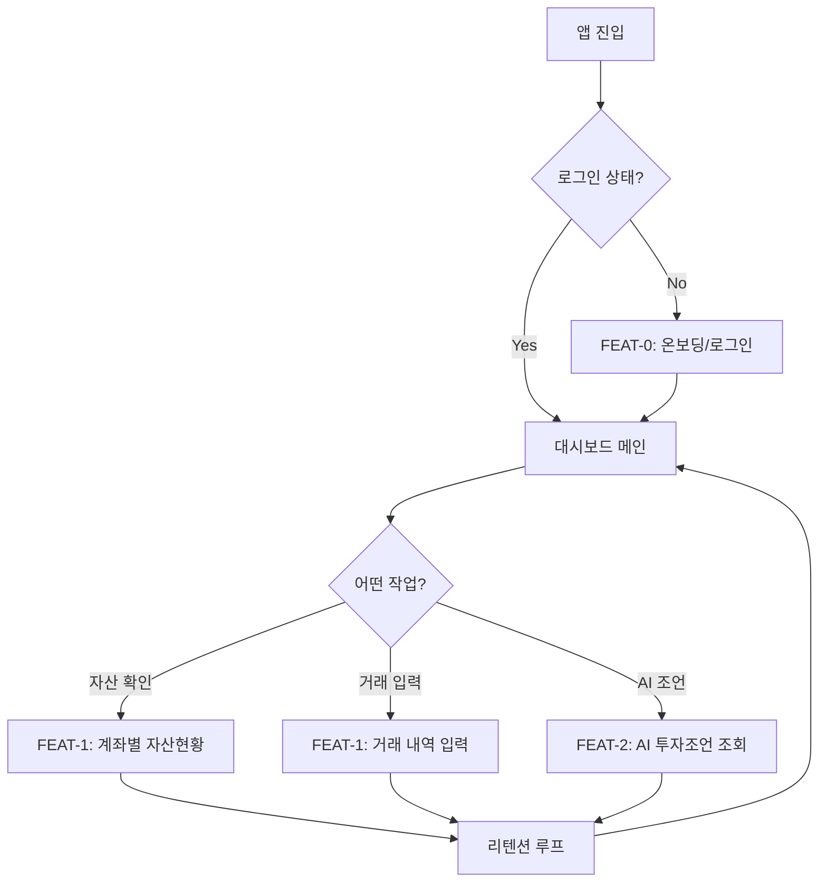
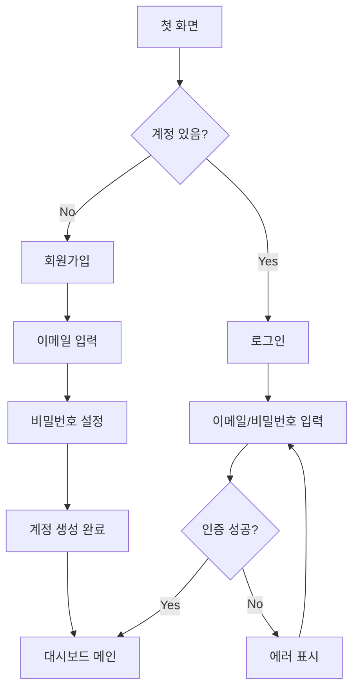
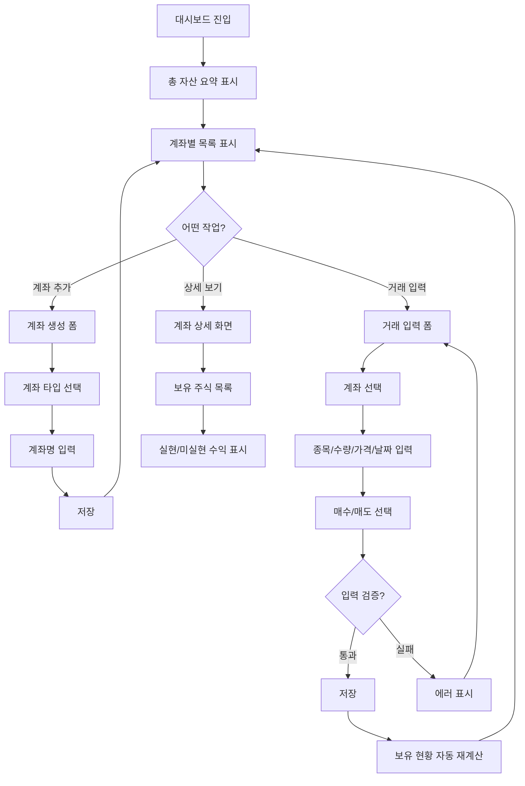
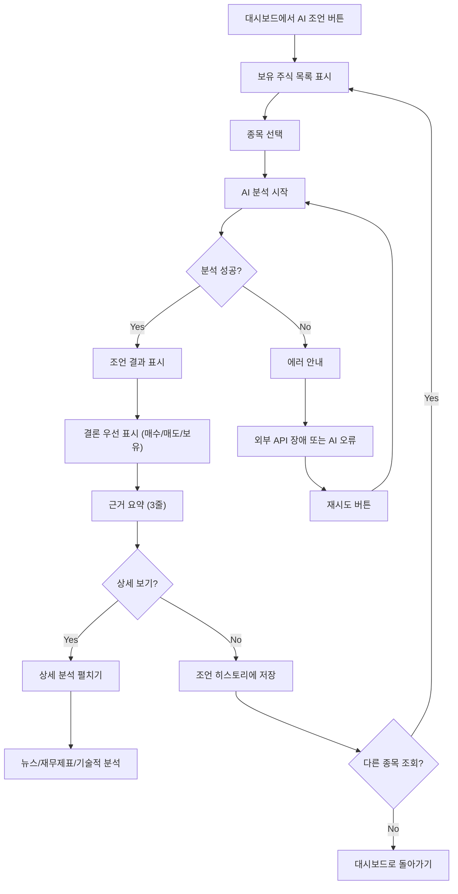
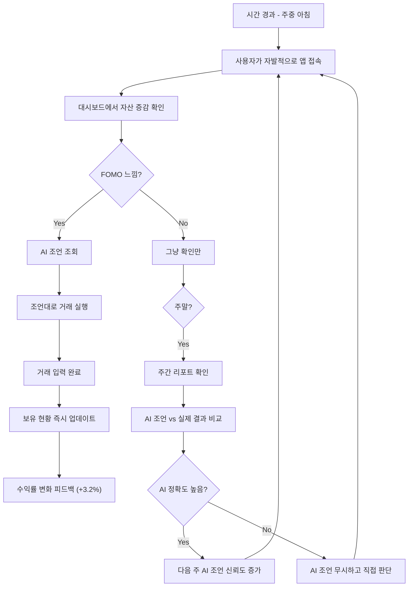
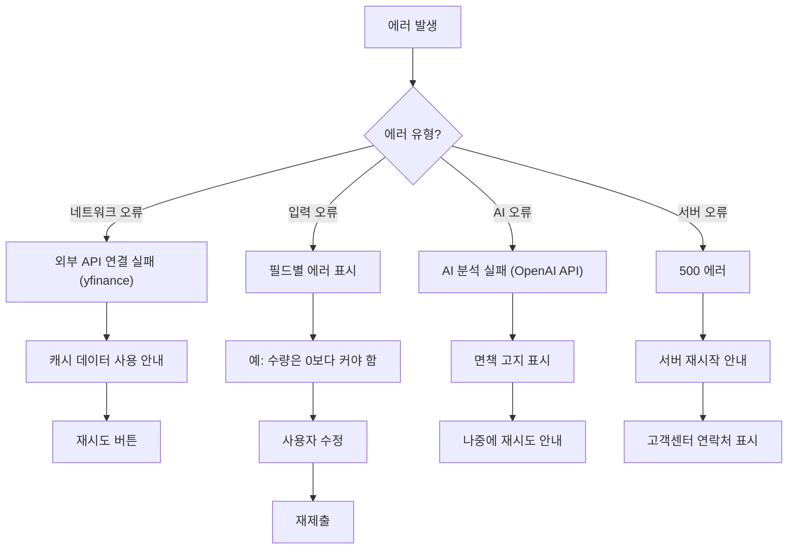

# User Flow (사용자 흐름도)

> Mermaid 플로우차트로 핵심 기능의 주요 여정을 표현합니다.
> 성공/실패 분기를 포함하고, 온보딩→핵심작업→리텐션 루프를 표현합니다.

---

## MVP 캡슐

| # | 항목 | 내용 |
|---|------|------|
| 1 | 목표 | 예금만 하던 투자 초보자가 AI 조언을 받으며 적극적으로 자산을 증식할 수 있도록 지원 |
| 2 | 페르소나 | 30대 후반 직장인, 투자 경험 없음, 가용자산 2억원, 월급 400만원 |
| 3 | 핵심 기능 | FEAT-1: 계좌별 자산현황 조회, FEAT-2: AI 투자조언 (매수/매도 추천) |
| 4 | 성공 지표 (노스스타) | 1년 자산 10% 증가 |
| 5 | 입력 지표 | AI 조언 vs 실제 결과 비교 (백테스팅), 주간 대시보드 확인 3회 이상 |
| 6 | 비기능 요구 | 모바일 반응형 웹, 데이터 영속성 (로컬 PC/NAS), 5초 이내 응답 |
| 7 | Out-of-scope | 증권사 계좌 자동 연동, 자동 매매, 세금 계산, 알림 시스템 |
| 8 | Top 리스크 | AI 조언이 부정확하여 사용자가 손실을 입을 가능성 |
| 9 | 완화/실험 | AI 조언 히스토리 추적, 백테스팅으로 정확도 개선, 면책 고지 |
| 10 | 다음 단계 | API 계약 정의 (Phase 0) 후 TDD 개발 시작 |

---

## 1. 전체 사용자 여정 (Overview)

---

## 2. FEAT-0: 온보딩/로그인 플로우

---

## 3. FEAT-1: 계좌별 자산현황 조회 플로우

---

## 4. FEAT-2: AI 투자조언 플로우

---

## 5. 리텐션 루프 (습관 형성)

---

## 6. 에러 처리 플로우

---

## 7. 화면 목록 (Screen Inventory)

| 화면 ID | 화면명 | FEAT | 진입점 | 주요 액션 |
|---------|--------|------|--------|----------|
| S-01 | 로그인 화면 | FEAT-0 | 앱 실행 | 이메일/비밀번호 입력 |
| S-02 | 회원가입 | FEAT-0 | S-01 | 계정 생성 |
| S-03 | 대시보드 메인 | - | S-01, S-02 | 총 자산 요약, 계좌 목록 |
| S-04 | 계좌 상세 | FEAT-1 | S-03 | 보유 주식 목록, 수익률 |
| S-05 | 거래 입력 | FEAT-1 | S-03, S-04 | 매수/매도 입력 |
| S-06 | AI 조언 | FEAT-2 | S-03, S-04 | 종목별 투자 조언 조회 |
| S-07 | 조언 히스토리 | FEAT-2 | S-06 | 과거 AI 조언 목록 |

---

## Decision Log 참조

| ID | 항목 | 선택 | 이유 |
|----|------|------|------|
| UF-01 | 홈 화면 | 대시보드 (총 자산 요약) | 사용자가 가장 먼저 보고 싶은 정보 |
| UF-02 | AI 조언 진입 | 대시보드에서 직접 접근 | 고빈도 사용 예상 |
| UF-03 | 거래 입력 | 수동 입력 폼 | 증권사 API 연동 불가 |
| UF-04 | 에러 처리 | 친절한 안내 + 재시도 | 투자 초보자 배려 |
