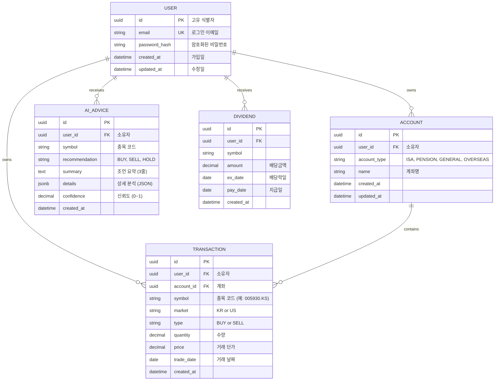
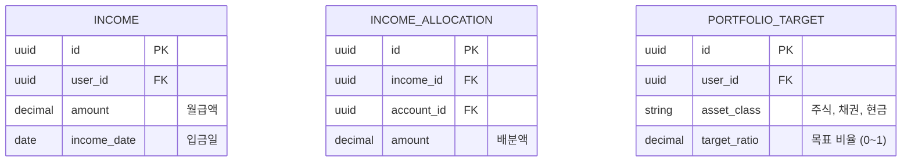

# Database Design (데이터베이스 설계)

> Mermaid ERD로 주요 엔티티와 관계를 표현합니다.
> 각 엔티티에 FEAT 주석을 달아 어떤 기능에서 사용되는지 명시합니다.
> 최소 수집 원칙을 반영하여 불필요한 개인정보는 지양합니다.

---

## MVP 캡슐

| # | 항목 | 내용 |
|---|------|------|
| 1 | 목표 | 예금만 하던 투자 초보자가 AI 조언을 받으며 적극적으로 자산을 증식할 수 있도록 지원 |
| 2 | 페르소나 | 30대 후반 직장인, 투자 경험 없음, 가용자산 2억원, 월급 400만원 |
| 3 | 핵심 기능 | FEAT-1: 계좌별 자산현황 조회, FEAT-2: AI 투자조언 (매수/매도 추천) |
| 4 | 성공 지표 (노스스타) | 1년 자산 10% 증가 |
| 5 | 입력 지표 | AI 조언 vs 실제 결과 비교 (백테스팅), 주간 대시보드 확인 3회 이상 |
| 6 | 비기능 요구 | 모바일 반응형 웹, 데이터 영속성 (로컬 PC/NAS), 5초 이내 응답 |
| 7 | Out-of-scope | 증권사 계좌 자동 연동, 자동 매매, 세금 계산, 알림 시스템 |
| 8 | Top 리스크 | AI 조언이 부정확하여 사용자가 손실을 입을 가능성 |
| 9 | 완화/실험 | AI 조언 히스토리 추적, 백테스팅으로 정확도 개선, 면책 고지 |
| 10 | 다음 단계 | API 계약 정의 (Phase 0) 후 TDD 개발 시작 |

---

## 1. ERD (Entity Relationship Diagram)



---

## 2. 엔티티 상세 정의

### 2.1 USER (사용자) - FEAT-0

| 컬럼 | 타입 | 제약조건 | 설명 |
|------|------|----------|------|
| id | UUID | PK | 고유 식별자 |
| email | VARCHAR(255) | UNIQUE, NOT NULL | 로그인 이메일 |
| password_hash | VARCHAR(255) | NOT NULL | bcrypt 해시 |
| created_at | TIMESTAMP | NOT NULL, DEFAULT NOW() | 가입일 |
| updated_at | TIMESTAMP | NOT NULL | 최종 수정일 |

**인덱스:**
- `idx_user_email` ON email

**최소 수집 원칙 적용:**
- 필수: email, password_hash
- 수집 안 함: 이름, 전화번호, 주소 (개인용이므로 불필요)

---

### 2.2 ACCOUNT (계좌) - FEAT-1

| 컬럼 | 타입 | 제약조건 | 설명 |
|------|------|----------|------|
| id | UUID | PK | 고유 식별자 |
| user_id | UUID | FK → USER.id, NOT NULL | 소유자 |
| account_type | VARCHAR(20) | NOT NULL | ISA, PENSION, GENERAL, OVERSEAS, GOLD |
| name | VARCHAR(100) | NOT NULL | 계좌명 (사용자 지정) |
| created_at | TIMESTAMP | NOT NULL, DEFAULT NOW() | 생성일 |
| updated_at | TIMESTAMP | NOT NULL | 수정일 |

**인덱스:**
- `idx_account_user_id` ON user_id
- `idx_account_type` ON account_type

**계좌 타입 정의:**
- `ISA`: 개인종합자산관리계좌
- `PENSION`: 연금저축
- `GENERAL`: 일반 계좌
- `OVERSEAS`: 해외주식 계좌
- `GOLD`: 금/원자재 계좌

---

### 2.3 TRANSACTION (거래 내역) - FEAT-1

| 컬럼 | 타입 | 제약조건 | 설명 |
|------|------|----------|------|
| id | UUID | PK | 고유 식별자 |
| user_id | UUID | FK → USER.id, NOT NULL | 소유자 |
| account_id | UUID | FK → ACCOUNT.id, NOT NULL | 계좌 |
| symbol | VARCHAR(20) | NOT NULL | 종목 코드 (예: 005930.KS, AAPL) |
| market | VARCHAR(2) | NOT NULL | KR or US |
| type | VARCHAR(4) | NOT NULL | BUY or SELL |
| quantity | DECIMAL(18, 4) | NOT NULL | 수량 |
| price | DECIMAL(18, 4) | NOT NULL | 거래 단가 |
| trade_date | DATE | NOT NULL | 거래 날짜 |
| created_at | TIMESTAMP | NOT NULL, DEFAULT NOW() | 입력일 |

**인덱스:**
- `idx_transaction_user_id` ON user_id
- `idx_transaction_account_id` ON account_id
- `idx_transaction_symbol` ON symbol
- `idx_transaction_trade_date` ON trade_date DESC

**중요 설계 원칙:**
- ❌ 보유 수량을 저장하지 않음
- ✅ 거래 내역만 저장
- ✅ 보유 수량은 쿼리로 실시간 계산:
  ```sql
  SELECT 
    SUM(CASE WHEN type = 'BUY' THEN quantity ELSE 0 END) -
    SUM(CASE WHEN type = 'SELL' THEN quantity ELSE 0 END) AS holding_qty
  FROM transactions
  WHERE user_id = ? AND symbol = ?
  ```

---

### 2.4 AI_ADVICE (AI 투자 조언) - FEAT-2

| 컬럼 | 타입 | 제약조건 | 설명 |
|------|------|----------|------|
| id | UUID | PK | 고유 식별자 |
| user_id | UUID | FK → USER.id, NOT NULL | 소유자 |
| symbol | VARCHAR(20) | NOT NULL | 종목 코드 |
| recommendation | VARCHAR(4) | NOT NULL | BUY, SELL, HOLD |
| summary | TEXT | NOT NULL | 조언 요약 (3줄 이내) |
| details | JSONB | NULL | 상세 분석 (JSON 구조) |
| confidence | DECIMAL(3, 2) | NULL | 신뢰도 (0.00~1.00) |
| created_at | TIMESTAMP | NOT NULL, DEFAULT NOW() | 조언 생성일 |

**인덱스:**
- `idx_advice_user_id` ON user_id
- `idx_advice_symbol` ON symbol
- `idx_advice_created_at` ON created_at DESC

**details JSONB 구조 예시:**
```json
{
  "news": ["최근 뉴스 1", "최근 뉴스 2"],
  "fundamentals": {
    "per": 12.5,
    "pbr": 1.2,
    "roe": 15.3
  },
  "technical": {
    "rsi": 45.2,
    "ma_20": 75000
  },
  "reasoning": "삼성전자 반도체 업황 개선 신호..."
}
```

---

### 2.5 DIVIDEND (배당금) - v2

| 컬럼 | 타입 | 제약조건 | 설명 |
|------|------|----------|------|
| id | UUID | PK | 고유 식별자 |
| user_id | UUID | FK → USER.id, NOT NULL | 소유자 |
| symbol | VARCHAR(20) | NOT NULL | 종목 코드 |
| amount | DECIMAL(18, 4) | NOT NULL | 배당금액 |
| ex_date | DATE | NOT NULL | 배당락일 |
| pay_date | DATE | NULL | 지급일 (예상) |
| created_at | TIMESTAMP | NOT NULL | 기록일 |

**인덱스:**
- `idx_dividend_user_id` ON user_id
- `idx_dividend_pay_date` ON pay_date

---

## 3. 관계 정의

| 부모 | 자식 | 관계 | 설명 |
|------|------|------|------|
| USER | ACCOUNT | 1:N | 사용자는 여러 계좌 보유 가능 |
| USER | TRANSACTION | 1:N | 사용자는 여러 거래 내역 보유 |
| ACCOUNT | TRANSACTION | 1:N | 계좌는 여러 거래 포함 |
| USER | AI_ADVICE | 1:N | 사용자는 여러 AI 조언 수신 |
| USER | DIVIDEND | 1:N | 사용자는 여러 배당금 수령 |

---

## 4. 핵심 쿼리 패턴

### 4.1 현재 보유 수량 계산

```sql
-- 특정 종목의 현재 보유 수량
SELECT 
  symbol,
  SUM(CASE WHEN type = 'BUY' THEN quantity ELSE -quantity END) AS holding_qty
FROM transactions
WHERE user_id = :user_id AND account_id = :account_id AND symbol = :symbol
GROUP BY symbol
HAVING SUM(CASE WHEN type = 'BUY' THEN quantity ELSE -quantity END) > 0;
```

### 4.2 평균 매입 단가 계산

```sql
-- 특정 종목의 평균 매입 단가
SELECT 
  symbol,
  SUM(CASE WHEN type = 'BUY' THEN quantity * price ELSE 0 END) /
  SUM(CASE WHEN type = 'BUY' THEN quantity ELSE 0 END) AS avg_buy_price
FROM transactions
WHERE user_id = :user_id AND symbol = :symbol
GROUP BY symbol;
```

### 4.3 실현 수익 계산

```sql
-- 특정 종목의 실현 수익 (FIFO 방식)
-- (복잡하므로 Python 로직으로 처리 예정)
```

### 4.4 계좌별 총 평가액

```sql
-- 계좌별 현재 보유 종목 + 현재가 조인 필요
-- yfinance API로 현재가 조회 후 애플리케이션 레벨에서 계산
```

---

## 5. 데이터 생명주기

| 엔티티 | 생성 시점 | 보존 기간 | 삭제/익명화 |
|--------|----------|----------|------------|
| USER | 회원가입 | 영구 | 사용자 수동 삭제 |
| ACCOUNT | 계좌 추가 | 영구 | Cascade delete (USER 삭제 시) |
| TRANSACTION | 거래 입력 | 영구 | Cascade delete (USER 삭제 시) |
| AI_ADVICE | AI 조언 생성 | 영구 | Cascade delete (USER 삭제 시) |
| DIVIDEND | 배당 수령 | 영구 | Cascade delete (USER 삭제 시) |

---

## 6. 확장 고려사항

### 6.1 v2에서 추가 예정 엔티티



### 6.2 인덱스 전략

- **읽기 최적화**: user_id, symbol, trade_date 자주 조회되므로 인덱스 필수
- **쓰기 고려**: 거래 입력은 빈도가 낮으므로 인덱스 부담 적음
- **복합 인덱스**: (user_id, symbol, trade_date) 고려 (v2)

---

## 7. 트랜잭션 설계 원칙

### 7.1 거래 입력 시

```python
# 거래 입력 시 트랜잭션 처리
BEGIN TRANSACTION;
  INSERT INTO transactions (...);
  # 보유 수량 자동 재계산 (쿼리)
COMMIT;
```

### 7.2 데이터 무결성

- **거래 수량**: quantity > 0 (CHECK 제약)
- **거래 가격**: price > 0 (CHECK 제약)
- **매도 시 보유 수량**: 애플리케이션 레벨에서 검증
  ```python
  holding_qty = calculate_holding(user_id, symbol)
  if trade_type == 'SELL' and quantity > holding_qty:
      raise ValueError("보유 수량 부족")
  ```

---

## Decision Log 참조

| ID | 항목 | 선택 | 이유 |
|----|------|------|------|
| DB-01 | 보유 수량 저장 | 저장하지 않음 | Transaction-based 설계, 원본 불변성 |
| DB-02 | 거래 내역 저장 | 모든 매수/매도 기록 | 실현 수익 계산, 감사 추적 |
| DB-03 | AI 조언 기록 | JSONB로 상세 분석 저장 | 백테스팅, 히스토리 추적 |
| DB-04 | 데이터베이스 | PostgreSQL | 거래 무결성, JSON 컬럼, Docker 실행 용이 |
