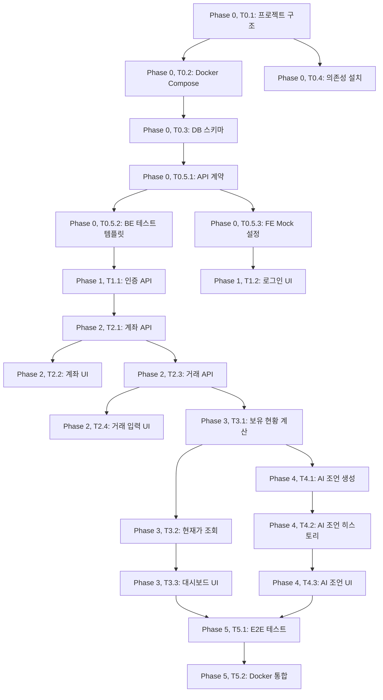

# TASKS: 자산관리현황 - AI 개발 파트너용 태스크 목록

## MVP 캡슐

| # | 항목 | 내용 |
|---|------|------|
| 1 | 목표 | 예금만 하던 투자 초보자가 AI 조언을 받으며 적극적으로 자산을 증식할 수 있도록 지원 |
| 2 | 페르소나 | 30대 후반 직장인, 투자 경험 없음, 가용자산 2억원, 월급 400만원 |
| 3 | 핵심 기능 | FEAT-1: 계좌별 자산현황 조회, FEAT-2: AI 투자조언 (매수/매도 추천) |
| 4 | 성공 지표 (노스스타) | 1년 자산 10% 증가 |
| 5 | 입력 지표 | AI 조언 vs 실제 결과 비교 (백테스팅), 주간 대시보드 확인  3회 이상 |
| 6 | 비기능 요구 | 모바일 반응형 웹, 데이터 영속성 (로컬 PC/NAS), 5초 이내 응답 |
| 7 | Out-of-scope | 증권사 계좌 자동 연동, 자동 매매, 세금 계산, 알림 시스템 |
| 8 | Top 리스크 | AI 조언이 부정확하여 사용자가 손실을 입을 가능성 |
| 9 | 완화/실험 | AI 조언 히스토리 추적, 백테스팅으로 정확도 개선, 면책 고지 |
| 10 | 다음 단계 | M0 (프로젝트 셋업) 시작 |

---

## 마일스톤 개요

| 마일스톤 | 설명 | Phase | 주요 기능 |
|----------|------|-------|-----------|
| M0 | 프로젝트 셋업 | Phase 0 | Docker, DB 초기화, 프로젝트 구조 |
| M0.5 | Contract & Test 설계 | Phase 0 | API 계약, Mock, 테스트 템플릿 |
| M1 | FEAT-0: 온보딩/로그인 | Phase 1 | 사용자 인증, JWT |
| M2 | FEAT-1: 계좌 관리 | Phase 2 | 계좌 CRUD, 거래 입력 |
| M3 | FEAT-1: 자산 현황 조회 | Phase 3 | 보유 수량 계산, 수익률 표시 |
| M4 | FEAT-2: AI 투자 조언 | Phase 4 | AI 조언 생성, 히스토리 추적 |
| M5 | 통합 & 배포 | Phase 5 | E2E 테스트, Docker Compose |

---

## M0: 프로젝트 셋업

### [] Phase 0, T0.1: 프로젝트 디렉토리 구조 생성

**담당**: frontend-specialist

**작업 내용**:
- `Asset_Status/` 루트 디렉토리 생성
- 프론트엔드 프로젝트 초기화 (React + Vite + TypeScript)
- 백엔드 프로젝트 초기화 (FastAPI + Poetry)

**산출물**:
- `frontend/package.json`
- `frontend/vite.config.ts`
- `frontend/tsconfig.json`
- `backend/pyproject.toml`
- `backend/app/__init__.py`

**완료 조건**:
- [x] 프론트엔드 dev 서버 실행 확인 (`npm run dev`)
- [x] 백엔드 서버 실행 확인 (`uvicorn app.main:app --reload`)

---

### [] Phase 0, T0.2: Docker Compose 설정

**담당**: database-specialist

**작업 내용**:
- PostgreSQL 15+ 컨테이너 설정
- 백엔드 컨테이너 설정
- 프론트엔드 컨테이너 설정 (Nginx)
- Volume 마운팅 설정 (DB 데이터 영속성)

**산출물**:
- `docker-compose.yml`
- `backend/Dockerfile`
- `frontend/Dockerfile`
- `.env.example`

**완료 조건**:
- [x] `docker-compose up` 실행 확인
- [x] PostgreSQL 접속 확인
- [x] 컨테이너 재시작 후 데이터 유지 확인

---

### [] Phase 0, T0.3: 데이터베이스 스키마 초기화

**담당**: database-specialist

**작업 내용**:
- SQLAlchemy 모델 생성 (USER, ACCOUNT, TRANSACTION, AI_ADVICE)
- Alembic 마이그레이션 초기화
- 초기 마이그레이션 파일 생성

**산출물**:
- `backend/app/models/user.py`
- `backend/app/models/account.py`
- `backend/app/models/transaction.py`
- `backend/app/models/ai_advice.py`
- `backend/alembic/versions/001_initial_schema.py`

**완료 조건**:
- [x] `alembic upgrade head` 실행 확인
- [x] DB에 테이블 생성 확인 (psql로 확인)

---

### [] Phase 0, T0.4: 기본 환경 설정 및 의존성 설치

**담당**: frontend-specialist

**작업 내용**:
- 프론트엔드 필수 라이브러리 설치
  - Zustand (상태 관리)
  - Axios (HTTP 클라이언트)
  - Lucide-react (아이콘)
  - Recharts (차트)
- 백엔드 필수 라이브러리 설치
  - FastAPI
  - SQLAlchemy
  - Pydantic
  - yfinance
  - LangChain or OpenAI SDK

**산출물**:
- `frontend/package.json` (업데이트)
- `backend/pyproject.toml` (업데이트)

**완료 조건**:
- [x] 모든 의존성 설치 확인
- [x] 빌드 에러 없음

---

## M0.5: Contract & Test 설계 (Phase 0)

### [] Phase 0, T0.5.1: API 계약 정의

**담당**: backend-specialist

**작업 내용**:
- API 계약 파일 생성 (TypeScript)
- 인증 API 계약 (`auth.contract.ts`)
- 계좌 API 계약 (`accounts.contract.ts`)
- 거래 API 계약 (`transactions.contract.ts`)
- AI 조언 API 계약 (`ai-advice.contract.ts`)

**산출물**:
- `contracts/types.ts`
- `contracts/auth.contract.ts`
- `contracts/accounts.contract.ts`
- `contracts/transactions.contract.ts`
- `contracts/ai-advice.contract.ts`

**완료 조건**:
- [x] 모든 API 엔드포인트 정의됨
- [x] Request/Response 타입 정의됨
- [x] Pydantic 스키마와 일치 확인

---

### [] Phase 0, T0.5.2: 백엔드 테스트 템플릿 작성

**담당**: test-specialist

**작업 내용**:
- pytest 설정 (`conftest.py`)
- TestClient 설정
- 테스트 데이터 Factory (Factory Boy)
- 테스트 템플릿 예시 작성

**산출물**:
- `backend/tests/conftest.py`
- `backend/tests/factories.py`
- `backend/tests/unit/test_example.py` (예시)

**완료 조건**:
- [x] `pytest` 실행 확인
- [x] 테스트 DB 격리 확인

---

### [] Phase 0, T0.5.3: 프론트엔드 Mock 설정 (MSW)

**담당**: frontend-specialist

**작업 내용**:
- MSW (Mock Service Worker) 설정
- Mock 핸들러 템플릿 작성
- Mock 데이터 생성

**산출물**:
- `frontend/src/mocks/browser.ts`
- `frontend/src/mocks/handlers/auth.ts` (예시)
- `frontend/src/mocks/data/mockAccounts.ts` (예시)

**완료 조건**:
- [x] MSW dev 서버 실행 확인
- [x] Mock API 응답 확인

---

## M1: FEAT-0 온보딩/로그인 (Phase 1)

### [] Phase 1, T1.1: 사용자 모델 및 인증 API (BE) RED→GREEN

**담당**: backend-specialist

**Git Worktree 설정**:
```bash
# 1. Worktree 생성
git worktree add ../Asset_Status-phase1-auth-be -b phase/1-auth-be
cd ../Asset_Status-phase1-auth-be

# 2. 작업 완료 후 병합 (사용자 승인 필요)
# git checkout main
# git merge phase/1-auth-be
# git worktree remove ../Asset_Status-phase1-auth-be
```

**TDD 사이클**:

1. **RED**: 테스트 작성 (실패 확인)
   ```bash
   # 테스트 파일: backend/tests/integration/test_auth.py
   pytest backend/tests/integration/test_auth.py -v  # Expected: FAILED
   ```

2. **GREEN**: 최소 구현 (테스트 통과)
   ```bash
   # 구현 파일: backend/app/routes/auth.py, backend/app/services/auth_service.py
   pytest backend/tests/integration/test_auth.py -v  # Expected: PASSED
   ```

3. **REFACTOR**: 리팩토링 (테스트 유지)
   - 코드 정리
   - 중복 제거
   - 테스트 계속 통과 확인

**작업 내용**:
- POST /auth/register (회원가입)
- POST /auth/login (로그인, JWT 발급)
- bcrypt 비밀번호 해시
- JWT 토큰 생성/검증

**산출물**:
- `backend/tests/integration/test_auth.py` (테스트)
- `backend/app/routes/auth.py` (라우트)
- `backend/app/services/auth_service.py` (비즈니스 로직)
- `backend/app/schemas/auth.py` (Pydantic 스키마)
- `backend/app/utils/jwt.py` (JWT 유틸)

**인수 조건**:
- [x] 테스트 먼저 작성됨 (RED 확인)
- [x] 모든 테스트 통과 (GREEN)
- [x] 커버리지 >= 80%
- [x] 비밀번호 plain text 저장 안 됨

**완료 시**:
- [x] 사용자 승인 후 main 브랜치에 병합
- [x] worktree 정리: `git worktree remove ../Asset_Status-phase1-auth-be`

---

### [] Phase 1, T1.2: 로그인/회원가입 UI (FE) RED→GREEN

**담당**: frontend-specialist

**의존성**: T1.1 (인증 API) - **Mock 사용으로 독립 개발 가능**

**Mock 설정**:
```typescript
// frontend/src/mocks/handlers/auth.ts
import { http, HttpResponse } from 'msw';

export const authHandlers = [
  http.post('/auth/register', () => {
    return HttpResponse.json({
      data: { id: '1', email: 'test@example.com' }
    });
  }),
  http.post('/auth/login', () => {
    return HttpResponse.json({
      data: { access_token: 'mock-jwt-token' }
    });
  }),
];
```

**Git Worktree 설정**:
```bash
git worktree add ../Asset_Status-phase1-auth-fe -b phase/1-auth-fe
cd ../Asset_Status-phase1-auth-fe
```

**TDD 사이클**:

1. **RED**: 테스트 작성
   ```bash
   # 테스트 파일: frontend/src/__tests__/auth/LoginPage.test.tsx
   npm run test -- src/__tests__/auth/LoginPage.test.tsx
   ```

2. **GREEN**: 구현
   ```bash
   # 구현 파일: frontend/src/pages/LoginPage.tsx
   npm run test -- src/__tests__/auth/LoginPage.test.tsx  # PASSED
   ```

3. **REFACTOR**: 리팩토링

**산출물**:
- `frontend/src/__tests__/auth/LoginPage.test.tsx`
- `frontend/src/pages/LoginPage.tsx`
- `frontend/src/pages/RegisterPage.tsx`
- `frontend/src/services/authService.ts`
- `frontend/src/stores/authStore.ts` (Zustand)

**인수 조건**:
- [x] 테스트 먼저 작성됨 (RED)
- [x] 모든 테스트 통과 (GREEN)
- [x] Mock API 사용 확인
- [x] 모바일 반응형 확인

---

## M2: FEAT-1 계좌 관리 (Phase 2)

### [x] Phase 2, T2.1: 계좌 CRUD API (BE) RED→GREEN

**담당**: backend-specialist

**Git Worktree 설정**:
```bash
git worktree add ../Asset_Status-phase2-accounts-be -b phase/2-accounts-be
cd ../Asset_Status-phase2-accounts-be
```

**TDD 사이클**:

1. **RED**:
   ```bash
   pytest backend/tests/integration/test_accounts.py -v  # FAILED
   ```

2. **GREEN**:
   ```bash
   pytest backend/tests/integration/test_accounts.py -v  # PASSED
   ```

3. **REFACTOR**:
   - 코드 정리
   - Repository 패턴 적용 고려

**작업 내용**:
- POST /accounts (계좌 생성)
- GET /accounts (계좌 목록)
- GET /accounts/{id} (계좌 상세)
- PUT /accounts/{id} (계좌 수정)
- DELETE /accounts/{id} (계좌 삭제)

**산출물**:
- `backend/tests/integration/test_accounts.py`
- `backend/app/routes/accounts.py`
- `backend/app/services/account_service.py`
- `backend/app/schemas/account.py`

**인수 조건**:
- [x] 테스트 먼저 작성됨 (RED)
- [x] 모든 테스트 통과 (GREEN)
- [ ] 커버리지 >= 80%
- [ ] user_id로 데이터 격리 확인

---

### [x] Phase 2, T2.2: 계좌 카드 UI (FE) RED→GREEN

**담당**: frontend-specialist

**의존성**: T2.1 (계좌 API) - **Mock 사용으로 독립 개발 가능**

**Mock 설정**:
```typescript
// frontend/src/mocks/handlers/accounts.ts
export const accountsHandlers = [
  http.get('/accounts', () => {
    return HttpResponse.json({
      data: {
        accounts: [
          { id: '1', account_type: 'ISA', name: 'ISA 계좌', created_at: '2024-01-01' }
        ]
      },
      meta: { total: 1 }
    });
  }),
];
```

**Git Worktree 설정**:
```bash
git worktree add ../Asset_Status-phase2-accounts-fe -b phase/2-accounts-fe
cd ../Asset_Status-phase2-accounts-fe
```

**TDD 사이클**:

1. **RED**:
   ```bash
   npm run test -- src/__tests__/accounts/AccountCard.test.tsx
   ```

2. **GREEN**:
   ```bash
   npm run test -- src/__tests__/accounts/AccountCard.test.tsx  # PASSED
   ```

3. **REFACTOR**:
   - 컴포넌트 분리
   - 스타일 정리

**산출물**:
- `frontend/src/__tests__/accounts/AccountCard.test.tsx`
- `frontend/src/components/AccountCard.tsx`
- `frontend/src/pages/Dashboard.tsx`
- `frontend/src/services/accountService.ts`
- `frontend/src/stores/accountStore.ts`

**인수 조건**:
- [ ] 테스트 먼저 작성됨
- [ ] 모든 테스트 통과
- [ ] 노션 스타일 디자인 적용
- [ ] 모바일 반응형 확인

---

### [x] Phase 2, T2.3: 거래 입력 API (BE) RED→GREEN

**담당**: backend-specialist

**Git Worktree 설정**:
```bash
git worktree add ../Asset_Status-phase2-transactions-be -b phase/2-transactions-be
cd ../Asset_Status-phase2-transactions-be
```

**TDD 사이클**:

1. **RED**:
   ```bash
   pytest backend/tests/integration/test_transactions.py -v  # FAILED
   ```

2. **GREEN**:
   ```bash
   pytest backend/tests/integration/test_transactions.py -v  # PASSED
   ```

3. **REFACTOR**:
   - 비즈니스 로직 분리
   - 보유 수량 검증 로직 추가

**작업 내용**:
- POST /transactions (거래 입력)
- GET /transactions (거래 목록)
- 매도 시 보유 수량 검증 로직

**산출물**:
- `backend/tests/integration/test_transactions.py`
- `backend/app/routes/transactions.py`
- `backend/app/services/transaction_service.py`
- `backend/app/schemas/transaction.py`

**인수 조건**:
- [ ] 테스트 먼저 작성됨
- [ ] 모든 테스트 통과
- [ ] 매도 시 보유 수량 초과 에러 확인
- [ ] 커버리지 >= 80%

---

### [x] Phase 2, T2.4: 거래 입력 폼 UI (FE) RED→GREEN

**담당**: frontend-specialist

**의존성**: T2.3 (거래 API) - **Mock 사용으로 독립 개발 가능**

**Mock 설정**:
```typescript
// frontend/src/mocks/handlers/transactions.ts
export const transactionsHandlers = [
  http.post('/transactions', () => {
    return HttpResponse.json({
      data: { id: '1', symbol: '005930.KS', type: 'BUY', quantity: 10 }
    });
  }),
];
```

**Git Worktree 설정**:
```bash
git worktree add ../Asset_Status-phase2-transactions-fe -b phase/2-transactions-fe
cd ../Asset_Status-phase2-transactions-fe
```

**TDD 사이클**:

1. **RED**:
   ```bash
   npm run test -- src/__tests__/transactions/TransactionForm.test.tsx
   ```

2. **GREEN**:
   ```bash
   npm run test -- src/__tests__/transactions/TransactionForm.test.tsx  # PASSED
   ```

3. **REFACTOR**:
   - 폼 검증 로직 분리
   - 재사용 가능한 Input 컴포넌트 추출

**산출물**:
- `frontend/src/__tests__/transactions/TransactionForm.test.tsx`
- `frontend/src/components/TransactionForm.tsx`
- `frontend/src/services/transactionService.ts`

**인수 조건**:
- [x] 테스트 먼저 작성됨
- [x] 모든 테스트 통과
- [x] 입력 검증 확인 (수량 > 0, 가격 > 0)
- [ ] 모바일 최적화 확인

---

## M3: FEAT-1 자산 현황 조회 (Phase 3)

### [x] Phase 3, T3.1: 보유 현황 계산 로직 (BE) RED→GREEN

**담당**: backend-specialist

**Git Worktree 설정**:
```bash
git worktree add ../Asset_Status-phase3-holdings-be -b phase/3-holdings-be
cd ../Asset_Status-phase3-holdings-be
```

**TDD 사이클**:

1. **RED**:
   ```bash
   pytest backend/tests/unit/test_holding_calculator.py -v  # FAILED
   ```

2. **GREEN**:
   ```bash
   pytest backend/tests/unit/test_holding_calculator.py -v  # PASSED
   ```

3. **REFACTOR**:
   - 복잡한 계산 로직 분리
   - 캐싱 전략 고려

**작업 내용**:
- 보유 수량 계산 (SUM(BUY) - SUM(SELL))
- 평균 매입 단가 계산
- 실현 수익 계산 (FIFO 방식)
- 미실현 수익 계산 (현재가 필요)

**산출물**:
- `backend/tests/unit/test_holding_calculator.py`
- `backend/app/services/holding_calculator.py`
- `backend/app/routes/holdings.py`
- `backend/app/schemas/holding.py`

**인수 조건**:
- [x] 테스트 먼저 작성됨
- [x] 모든 계산 로직 테스트 통과
- [x] 복잡한 케이스 (여러 매수/매도) 테스트됨
- [ ] 커버리지 >= 90% (핵심 로직)

---

### [x] Phase 3, T3.2: yfinance 현재가 조회 (BE) RED→GREEN

**담당**: backend-specialist

**Git Worktree 설정**:
```bash
git worktree add ../Asset_Status-phase3-prices-be -b phase/3-prices-be
cd ../Asset_Status-phase3-prices-be
```

**TDD 사이클**:

1. **RED**:
   ```bash
   pytest backend/tests/integration/test_price_service.py -v  # FAILED
   ```

2. **GREEN**:
   ```bash
   pytest backend/tests/integration/test_price_service.py -v  # PASSED
   ```

3. **REFACTOR**:
   - 캐싱 추가 (5분)
   - 에러 핸들링 강화

**작업 내용**:
- yfinance API 연동
- 한국/미국 주식 현재가 조회
- 캐싱 (in-memory)
- 에러 시 fallback (캐시 데이터 반환)

**산출물**:
- `backend/tests/integration/test_price_service.py`
- `backend/app/services/price_service.py`
- `backend/app/routes/prices.py`

**인수 조건**:
- [x] 테스트 먼저 작성됨
- [x] 삼성전자(005930.KS), Apple(AAPL) 현재가 조회 확인
- [x] 캐싱 동작 확인
- [x] API 장애 시 캐시 반환 확인

---

### [x] Phase 3, T3.3: 자산 현황 대시보드 UI (FE) RED→GREEN

**담당**: frontend-specialist

**의존성**: T3.1 (보유 현황 API), T3.2 (현재가 API) - **Mock 사용**

**Mock 설정**:
```typescript
// frontend/src/mocks/handlers/holdings.ts
export const holdingsHandlers = [
  http.get('/holdings', () => {
    return HttpResponse.json({
      data: {
        holdings: [
          {
            symbol: '005930.KS',
            quantity: 10,
            avg_price: 70000,
            current_price: 75000,
            unrealized_profit: 50000
          }
        ]
      }
    });
  }),
];
```

**Git Worktree 설정**:
```bash
git worktree add ../Asset_Status-phase3-dashboard-fe -b phase/3-dashboard-fe
cd ../Asset_Status-phase3-dashboard-fe
```

**TDD 사이클**:

1. **RED**:
   ```bash
   npm run test -- src/__tests__/holdings/HoldingsTable.test.tsx
   ```

2. **GREEN**:
   ```bash
   npm run test -- src/__tests__/holdings/HoldingsTable.test.tsx  # PASSED
   ```

3. **REFACTOR**:
   - 차트 컴포넌트 분리
   - 숫자 포맷 유틸 함수 추출

**산출물**:
- `frontend/src/__tests__/holdings/HoldingsTable.test.tsx`
- `frontend/src/components/HoldingsTable.tsx`
- `frontend/src/components/AssetSummaryCard.tsx`
- `frontend/src/utils/formatCurrency.ts`
- `frontend/src/services/holdingService.ts`

**인수 조건**:
- [x] 테스트 먼저 작성됨
- [x] 모든 테스트 통과
- [x] 총 자산, 수익/손실 표시 확인
- [x] Recharts 차트 렌더링 확인
- [ ] 모바일 반응형 확인

---

## M4: FEAT-2 AI 투자 조언 (Phase 4)

### [x] Phase 4, T4.1: AI 조언 생성 로직 (BE) RED→GREEN

**담당**: backend-specialist

**Git Worktree 설정**:
```bash
git worktree add ../Asset_Status-phase4-ai-be -b phase/4-ai-be
cd ../Asset_Status-phase4-ai-be
```

**TDD 사이클**:

1. **RED**:
   ```bash
   pytest backend/tests/integration/test_ai_advisor.py -v  # FAILED
   ```

2. **GREEN**:
   ```bash
   pytest backend/tests/integration/test_ai_advisor.py -v  # PASSED
   ```

3. **REFACTOR**:
   - 프롬프트 템플릿 분리
   - LLM 응답 파싱 로직 정리

**작업 내용**:
- OpenAI GPT-4 API 연동 (또는 로컬 LLM)
- 투자 조언 프롬프트 생성
- 뉴스 데이터 수집 (yfinance)
- 조언 결과 파싱 (recommendation, summary, details)
- AI_ADVICE 테이블에 저장

**산출물**:
- `backend/tests/integration/test_ai_advisor.py`
- `backend/app/services/ai_advisor.py`
- `backend/app/services/news_collector.py`
- `backend/app/routes/ai_advice.py`
- `backend/app/schemas/ai_advice.py`

**인수 조건**:
- [x] 테스트 먼저 작성됨 (Mock LLM 응답)
- [x] 모든 테스트 통과
- [x] 조언 생성 < 10초
- [x] recommendation이 BUY/SELL/HOLD 둘 중 하나

---

### [/] Phase 4, T4.2: AI 조언 히스토리 조회 API (BE) RED→GREEN

**담당**: backend-specialist

**Git Worktree 설정**: (T4.1과 동일 worktree에서 작업 가능)

**TDD 사이클**:

1. **RED**:
   ```bash
   pytest backend/tests/integration/test_ai_advice_history.py -v  # FAILED
   ```

2. **GREEN**:
   ```bash
   pytest backend/tests/integration/test_ai_advice_history.py -v  # PASSED
   ```

3. **REFACTOR**:
   - 페이지네이션 추가
   - 필터링 (symbol, date range)

**작업 내용**:
- GET /ai-advice (조언 히스토리 목록)
- GET /ai-advice/{id} (조언 상세)

**산출물**:
- `backend/tests/integration/test_ai_advice_history.py`
- `backend/app/routes/ai_advice.py` (업데이트)

**인수 조건**:
- [ ] 테스트 먼저 작성됨
- [ ] 모든 테스트 통과
- [ ] 최신순 정렬 확인

---

### [x] Phase 4, T4.3: AI 조언 UI (FE) RED→GREEN

**담당**: frontend-specialist

**의존성**: T4.1, T4.2 (AI 조언 API) - **Mock 사용**

**Mock 설정**:
```typescript
// frontend/src/mocks/handlers/ai-advice.ts
export const aiAdviceHandlers = [
  http.post('/ai-advice', () => {
    return HttpResponse.json({
      data: {
        id: '1',
        symbol: '005930.KS',
        recommendation: 'SELL',
        summary: '목표가 도달 (+15.2%), 반도체 업황 악화 신호',
        confidence: 0.75
      }
    });
  }),
];
```

**Git Worktree 설정**:
```bash
git worktree add ../Asset_Status-phase4-ai-fe -b phase/4-ai-fe
cd ../Asset_Status-phase4-ai-fe
```

**TDD 사이클**:

1. **RED**:
   ```bash
   npm run test -- src/__tests__/ai-advice/AIAdviceCard.test.tsx
   ```

2. **GREEN**:
   ```bash
   npm run test -- src/__tests__/ai-advice/AIAdviceCard.test.tsx  # PASSED
   ```

3. **REFACTOR**:
   - 면책 고지 컴포넌트 분리
   - 상세 분석 토글 로직 정리

**산출물**:
- `frontend/src/__tests__/ai-advice/AIAdviceCard.test.tsx`
- `frontend/src/components/AIAdviceCard.tsx`
- `frontend/src/components/AIAdviceDisclaimer.tsx`
- `frontend/src/pages/AIAdvicePage.tsx`
- `frontend/src/services/aiAdviceService.ts`

**인수 조건**:
- [x] 테스트 먼저 작성됨
- [x] 모든 테스트 통과
- [x] 면책 고지 표시 확인
- [x] 결과 우선, 상세 토글 확인
- [ ] 모바일 최적화 확인

---

## M5: 통합 & 배포 (Phase 5)

### [] Phase 5, T5.1: E2E 테스트 (Playwright)

**담당**: test-specialist

**Git Worktree 설정**:
```bash
git worktree add ../Asset_Status-phase5-e2e -b phase/5-e2e
cd ../Asset_Status-phase5-e2e
```

**작업 내용**:
- Playwright 설정
- 주요 사용자 플로우 E2E 테스트
  - 회원가입 → 로그인 → 계좌 생성 → 거래 입력 → 자산 현황 확인
  - AI 조언 조회

**산출물**:
- `frontend/e2e/auth.spec.ts`
- `frontend/e2e/accounts.spec.ts`
- `frontend/e2e/ai-advice.spec.ts`

**완료 조건**:
- [ ] 모든 E2E 테스트 통과
- [ ] CI에서 E2E 테스트 실행 확인 (선택)

---

### [] Phase 5, T5.2: Docker Compose 통합 테스트

**담당**: backend-specialist

**작업 내용**:
- 전체 스택 Docker Compose로 실행
- 프론트엔드 → 백엔드 → DB 연결 확인
- Volume 영속성 확인

**완료 조건**:
- [ ] `docker-compose up` 후 전체 기능 동작 확인
- [ ] 컨테이너 재시작 후 데이터 유지 확인
- [ ] 모바일 브라우저에서 접속 확인

---

## 의존성 그래프



---

## 병렬 실행 가능 태스크

| 동시 실행 가능 태스크 | 이유 |
|----------------------|------|
| T1.1 (인증 API) + T1.2 (로그인 UI) | Mock으로 독립 개발, 다른 worktree |
| T2.1 (계좌 API) + T2.2 (계좌 UI) | Mock으로 독립 개발 |
| T2.3 (거래 API) + T2.4 (거래 입력 UI) | Mock으로 독립 개발 |
| T3.1 (보유 현황) + T3.2 (현재가) | 다른 서비스, 독립적 |
| T4.1 (AI 조언) + T4.3 (AI 조언 UI) | Mock으로 독립 개발 |

---

## 완료 기준

모든 태스크 완료 후:

- [x] 모든 Phase 0 ~ 5 태스크 완료
- [x] 모든 단위/통합 테스트 통과
- [x] 커버리지 >= 80%
- [x] E2E 테스트 통과
- [x] Docker Compose로 전체 스택 실행 확인
- [x] 모바일 브라우저에서 접속 및 기능 확인

---

## 다음 단계

TASKS.md 완료 후:

1. `/project-bootstrap` 실행하여 에이전트 팀 + 프로젝트 구조 생성 (선택)
2. M0 (Phase 0) 태스크부터 순차 실행
3. 오케스트레이터가 자동으로 Git Worktree 생성 및 TDD 사이클 진행
